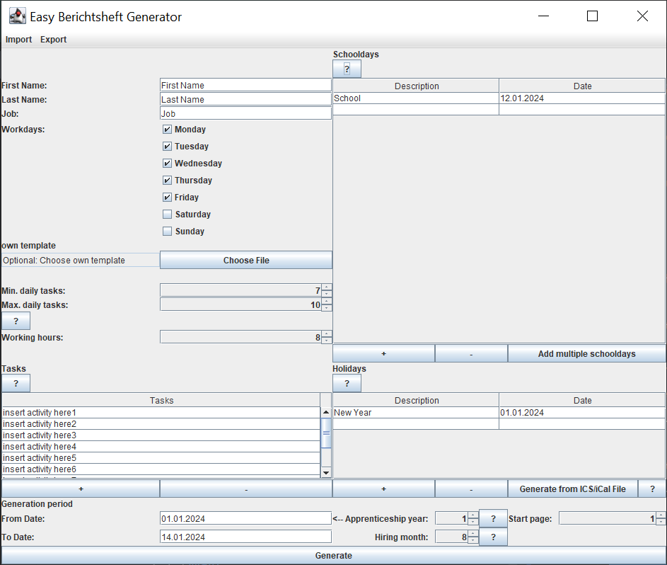

<h1 align="center">Easy Berichtsheft Generator</h1>

<p align="center">
:green_circle: <a href="https://github.com/Timon-Schneider/easy-berichtsheft-generator/releases/latest/download/easy-berichtsheft-generator-EXE-and-JAR.zip" download>DOWNLOAD</a> :green_circle: <br><br>
ENGLISH VERSION BELOW! <br><br>
Erstelle ganz einfach und in kürzester Zeit dein Berichtsheft! Und das kostenlos!<br><br>
Einfach Ausbildungstätigkeiten, Schul- und Feiertage gesammelt eintragen und dieses Tool erstellt so viele Seiten eines Berichtsheftes wie du möchtest.
Die Tätigkeiten werden zufällig angeordnet automatisch in jeden Tag eingetragen. Keine Sorge, jede Tätigkeit erscheint nur einmal pro Tag.
</p>
<p align="center">
Beim ersten Start ist alles ist bereits vorkonfiguriert. Klicke einfach auf die Schaltfläche "Generieren", um die Ausgabe zu sehen. Nach der Generierung kannst du alle notwendigen Änderungen oder Anpassungen vornehmen, um deinen spezifischen Anforderungen gerecht zu werden. Außerdem kannst du einige Teile des Programms speichern, indem du die Import- und Exportfunktionen am oberen Rand des Fensters verwendest.
</p>


## Verwendung

- [HIER](https://github.com/Timon-Schneider/easy-berichtsheft-generator/releases/latest) unter Assets die .zip Datei herunterladen
- "easy-berichtsheft-generator.exe" oder "easy-berichtsheft-generator.jar" starten.
- Ausbildungstätigkeiten gesammelt in die Tabelle eintragen.
  Es müssen mindestens so viele Tätigkeiten eingetragen werden wie später pro Tag generiert werden sollen.
- Feiertage, Urlaubstage und Schultage gesammelt in die jeweiligen Tabellen eintragen.
- UM ZEIT ZU SPAREN KANN DAS PROGRAMM DIE SCHULTAGE FÜR EINEN ANGEGEBENEN ZEITRAUM SELBST IN DIE TABELLE SCHREIBEN.
  (SOWOHL FÜR WÖCHENTLICHEN UNTERRICHT ALS AUCH FÜR BLOCKUNTERRICHT).
  Einfach die Schaltfläche "Mehrere Schultage hinzufügen" klicken.
- FEIERTAGE KÖNNEN EBENFALLS AUTOMATISCH IN DIE TABELLE GESCHRIEBEN WERDEN, WENN EINE iCAL/ICS DATEI ZUR VERFÜGUNG STEHT. Eine solche Datei kann von der Seite [https://www.schulferien.org/deutschland/ical/](https://www.schulferien.org/deutschland/ical/) heruntergeladen werden.
- Es kann optional eine eigene Vorlage verwendet werden. Dazu einfach eine .docx Datei vorbereiten und im Program auswählen. Weiter unten gibt es informationen zur Gestaltung der Platzhalter
- Alle weiteren Einstellungen sollten leicht zu verstehen sein. Es stehen für einige Funktionen Hilfe-Knöpfe zur verfügung. 

---
## Vorlage

Du kannst auch deine eigene Vorlage verwenden, wenn du sie im .docx Format speicherst.
Wichtig ist dabei, dass immer diese Platzhalter irgendwo nach Belieben eingesetzt werden:

```
${name}
${profession}
${trainingYear}
${fD}
${fM}
${fY}
${lD}
${lM}
${lY}
${y}
${p}
${moTask}
${tuTask}
${weTask}
${thTask}
${frTask}
${saTask}
${suTask}
${hMo}
${hTu}
${hWe}
${hTh}
${hFr}
${hSa}
${hSu}
```

Wenn du sehen willst, wie eine korrekte Vorlage aussieht, schaue dir die mitgelieferte Vorlage an oder verändere sie.

(Diese Platzhalter wurden direkt aus dem code kopiert. Eventuelle Schreibfehler müssen übernommen werden,
da es sonst zu Fehlern kommen könnte)


### To Do
Schaue [hier](https://github.com/Timon-Schneider/easy-berichtsheft-generator/issues)

Vorschläge werden gerne gesehen!

### Spenden
<a href="https://www.paypal.com/donate?hosted_button_id=ULE8THN3EAHJL" target="_blank"></a>

(Timon Schneider)

----

<h1 align="center">Easy Berichtsheft Generator</h1>

<p align="center">
:green_circle: <a href="https://github.com/Timon-Schneider/easy-berichtsheft-generator/releases/latest/download/easy-berichtsheft-generator-EXE-and-JAR.zip" download>DOWNLOAD</a> :green_circle: <br><br>
THIS PROGRAM COMES WITH AN ENGLISH VERSION! <br><br>
Create your report booklet quickly and easily! And it's free of charge!<br><br>
Simply enter your training activities, school days and public holidays and this tool will create as many pages of a report booklet as you like.
The activities are automatically entered into each day in random order. Don't worry, each activity only appears once a day.
</p>
<p align="center">
Everything is already preconfigured when you first start. Simply click on the "Generate" button to see the output. After generation, you can make any necessary changes or adjustments to meet your specific requirements. You can also save some parts of the program by using the import and export functions at the top of the window.
</p>



## Usage

- Download the .zip file [HERE](https://github.com/Timon-Schneider/easy-berichtsheft-generator/releases/latest) under Assets
- Start "easy-berichtsheft-generator.exe" or "easy-berichtsheft-generator.jar".
- Enter your Tasks collectively in the table.
  At least as many Tasks must be entered as are to be generated later per day.
- Enter public holidays, vacation days and school days in the respective tables.
- TO SAVE TIME, THE PROGRAM CAN WRITE THE SCHOOL DAYS FOR A SPECIFIED PERIOD INTO THE TABLE ITSELF.
  (BOTH FOR WEEKLY LESSONS AND FOR BLOCK LESSONS).
  Simply click the "Add multiple school days" button.
- If an iCAL/ICS file is available, holidays can be written to the table automatically. Such a file can be downloaded from [https://www.schulferien.org/deutschland/ical/](https://www.schulferien.org/deutschland/ical/).
- Optionally, you can use your own template. Simply prepare a .docx file and select it in the program. Below you will find information on how to design the placeholders.
- All other settings should be easy to understand. Help buttons are available for some functions.

---
## Template

You can also use your own template if you save it in .docx format.
It is important that these placeholders are always inserted somewhere as desired:

```
${name}
${profession}
${trainingYear}
${fD}
${fM}
${fY}
${lD}
${lM}
${lY}
${y}
${p}
${moTask}
${tuTask}
${weTask}
${thTask}
${frTask}
${saTask}
${suTask}
${hMo}
${hTu}
${hWe}
${hTh}
${hFr}
${hSa}
${hSu}
```

If you want to see what a correct template looks like, take a look at the supplied template or modify it.

(These placeholders were copied directly from the code. Any spelling mistakes must be copied,
otherwise errors could occur)

### To Do
Look [here](https://github.com/Timon-Schneider/easy-berichtsheft-generator/issues)

Suggestions are welcome!

### Donations
<a href="https://www.paypal.com/donate?hosted_button_id=ULE8THN3EAHJL" target="_blank"></a>

(Timon Schneider)

----

## License

easy-berichtsheft-generator
Copyright (c) 2024. Timon Schneider (timon-schneider.com).

This program is free software: you can redistribute it and/or modify it under the terms of the GNU General Public License as published by the Free Software Foundation, either version 3 of the License, or (at your option) any later version.

This program is distributed in the hope that it will be useful, but WITHOUT ANY WARRANTY; without even the implied warranty of MERCHANTABILITY or FITNESS FOR A PARTICULAR PURPOSE. See the GNU General Public License for more details.

You should have received a copy of the GNU General Public License along with this program. If not, see <https://www.gnu.org/licenses/>.

----

